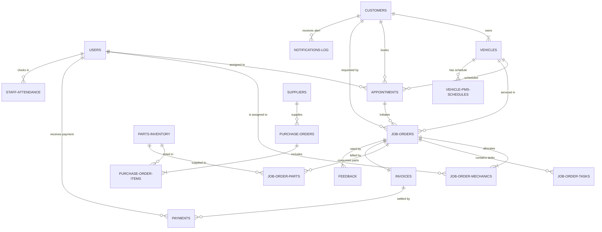
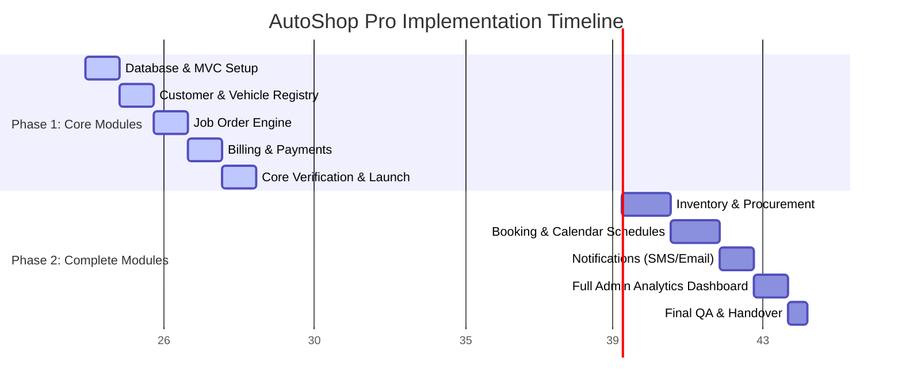

# AutoShop Pro — System Architecture & Implementation Blueprint

This blueprint outlines the design, database architecture, folder structure, business workflows, security models, and deployment strategy for **AutoShop Pro**, a premium automotive repair workshop management system built using PHP & MySQL.

---

## 1. Project Goal & Scope
AutoShop Pro is designed to digitize and streamline the operations of mid-to-large scale automotive service centers. The system manages the entire customer lifecycle, vehicle history, booking schedules, job card logs, inventory tracking, invoicing, and messaging alerts.

### Subscription & Plan Specifics
*   **Standard Plan:** ₱3,000 / month
*   **Setup Fee:** ₱5,000 (one-time; includes onboarding, data migration, and staff training)
*   **User Accounts:** Up to 5 concurrent staff accounts with role-based access control.
*   **Annual Offer:** ₱30,000 / year (discount equivalent to 2 months free).
*   **Data Portability:** 30 days data export accessibility (.xlsx / .csv / PDF) post-cancellation.

---

## 2. Directory Structure (Clean PHP MVC Architecture)

To ensure high maintainability, testing capability, and scalability, AutoShop Pro will implement a structured Model-View-Controller (MVC) directory design.

```text
Autoshop-Pro/
├── .gitignore
├── README.md
├── database.sql                    # MySQL database creation script
├── blueprint.md                    # System architecture design blueprint
├── composer.json                   # PHP library dependencies (PHPMailer, PhpSpreadsheet, FPDF)
├── config/
│   ├── app.php                     # App settings (timezone, debug mode, active URLs)
│   ├── db.php                      # PDO connection configuration
│   └── mail_sms.php                # API credentials for email (SMTP) and SMS (Twilio/Semaphore)
├── public/                         # Public web root
│   ├── index.php                   # Frontend Controller / Application Entrypoint
│   ├── .htaccess                   # URL rewriting for clean URLs (mod_rewrite)
│   ├── assets/
│   │   ├── css/                    # Custom CSS files (theme, dashboards, custom UI elements)
│   │   ├── js/                     # Custom JS files (Ajax handlers, charts, validations)
│   │   └── img/                    # Icons, logos, exit photos, signatures
│   └── uploads/                    # User files (dynamic directories created by app)
│       ├── photos/                 # Job Order exit verification photos
│       ├── signatures/             # Digital release signatures
│       └── documents/              # Scan of vehicle registration papers
├── src/                            # Source classes folder (Autoloaded)
│   ├── Core/
│   │   ├── Controller.php          # Base Controller class
│   │   ├── Model.php               # Base Model class with PDO active record wrappers
│   │   ├── Router.php              # Regex-based routing engine
│   │   ├── Request.php             # Input sanitizer and request validator
│   │   ├── Response.php            # JSON and redirect response wrapper
│   │   └── Session.php             # Secure session management and CSRF verification
│   ├── Controllers/
│   │   ├── AuthController.php      # Login, Logout, Session enforcement
│   │   ├── CustomerController.php  # Module 01: Profiles
│   │   ├── VehicleController.php   # Module 01: Registry
│   │   ├── AppointmentController.php# Module 02: Calendar & Bay Slots
│   │   ├── JobOrderController.php   # Module 03: Work Orders & Cleanliness checks
│   │   ├── InventoryController.php  # Module 04: Stock levels & Procurement
│   │   ├── BillingController.php    # Module 05: Invoicing, discounts, payments
│   │   ├── NotificationController.php # Module 06: Auto-alerts & Scheduled PMS reminders
│   │   ├── StaffController.php      # Module 07: Mechanic load & Attendance clocking
│   │   └── DashboardController.php  # Module 08: Live metrics & Excel/PDF exports
│   ├── Models/
│   │   └── [Entity].php            # Mapping objects to DB tables (e.g. Customer.php, Vehicle.php)
│   └── Helpers/
│       ├── SMSGateway.php          # External SMS integration wrapper
│       ├── EmailGateway.php        # SMTP mail handler
│       ├── PDFGenerator.php        # Wrapper for Invoice/Gate Pass PDF generation
│       └── ExcelExporter.php       # Wrapper for generating .xlsx files
└── views/                          # HTML View templates (PHP templating engine)
    ├── layouts/
    │   ├── header.php              # Navs, HTML headers, viewport config
    │   ├── footer.php              # Scripts, copyright, micro-animations
    │   └── sidebar.php             # Dynamic sidebar reflecting current staff roles
    ├── dashboard/                  # Multi-dashboard views
    ├── customers/                  # Customer list, profiles, vehicle service timeline
    ├── appointments/               # Booking calendar, release schedulers
    ├── job_orders/                 # Checklist, assignments, gate pass printable views
    ├── inventory/                  # Catalog, low stock visual warnings, suppliers
    ├── billing/                    # Invoices, receipts, discount toggles
    ├── staff/                      # Mechanic timesheets, overtime logs
    └── errors/                     # 403, 404, 500 error pages
```

---

## 3. Relational Database Design (MySQL)

The database structure is designed to support high integrity with foreign key constraints, automatic data generation, indexing on search-intensive parameters, and logging mechanisms.

The complete SQL schema is defined in [database.sql](file:///Applications/XAMPP/xamppfiles/htdocs/Autoshop-Pro/database.sql).

### Visual Schema Relationships (ERD Mapping)



### Table Definitions and Structure Highlights

1.  **`users`**: Manages credentials and role-based clearance.
    *   *Security Note:* Passwords stored using `PHP password_hash()` with `PASSWORD_BCRYPT`.
2.  **`customers`**: Profiles with category classification (Individual, Fleet, Corporate). Blacklisted flags bypass new appointment bookings.
3.  **`vehicles`**: Plate numbers and VIN fields are unique. Indexes allow speedy search query results when lookup happens at the shop gate.
4.  **`appointments`**: Manages bay slots and calendar slots. Tracks estimated release times compared to actual release times to report team compliance.
5.  **`job_orders`**: The shop's operational record. Links pre-release safety checklists, gate passes, signature blobs, exit photos, and actual timestamps.
6.  **`job_order_tasks`**: Stores individual labor tasks, estimated hours, hourly rate vs. fixed rate, and start/end timestamps to measure mechanic efficiency.
7.  **`parts_inventory`**: Catalog with location/bin tracking. Includes a virtual generated column `markup_percentage` representing margins: `((selling_price - cost_price) / cost_price) * 100`.
8.  **`purchase_orders` & `purchase_order_items`**: Manages procurement from suppliers and updates `current_stock` upon marked "received" status.
9.  **`job_order_parts`**: Tracks which spares were allocated to a job card. Links directly to inventory for deduction calculations.
10. **`invoices`**: Contains subtotal labor, subtotal parts, tax calculations (12% standard Ph VAT), discount structures, and a balance due tracker.
11. **`payments`**: Records payments against invoices. Logs payment method (Cash, Card, GCash, Maya, Bank Transfer) and reference IDs.
12. **`notifications_log`**: Logs all outgoing SMS/emails with a delivery status (Pending, Sent, Failed, Read).
13. **`vehicle_pms_schedules`**: Automates alerts for PMS checks. Compares mileage (5,000 km standard) and date intervals (3-month intervals).
14. **`feedback`**: Rating indices (1 to 5 stars) and qualitative comments linked to Job Orders.
15. **`staff_attendance`**: Clock-in and clock-out monitoring, facilitating automated overtime logic calculations.

---

## 4. Multi-User Access & Role Clearance Matrix

Each page or action request passes through an Authentication & Role Check filter before rendering views or executing SQL commands:

| Module Feature / Action | Admin | Service Advisor | Cashier | Mechanic | Guard |
| :--- | :---: | :---: | :---: | :---: | :---: |
| **Manage Users & Settings** | **Full** | None | None | None | None |
| **Customer & Vehicle Reg** | **Full** | **Full** | Read Only | Read Only | None |
| **Appointments & Sched** | **Full** | **Full** | Read Only | Read Only | None |
| **Create Job Orders** | **Full** | **Full** | None | None | None |
| **Perform/Log Tasks (Labor)**| **Full** | Read Only | None | **Full** (Self) | None |
| **Parts Stock & Catalog** | **Full** | Read Only | None | Read Only | None |
| **Procurement (PO Creation)**| **Full** | None | None | None | None |
| **Invoice Generation** | **Full** | Read Only | **Full** | None | None |
| **Collect Payments** | **Full** | None | **Full** | None | None |
| **Send Notifications** | **Full** (Auto) | **Full** (Auto)| None | None | None |
| **Gate Pass Validation** | **Full** | Read Only | Read Only | None | **Full** (Scan/Verify) |
| **Reports & Dashboard** | **Full** | None | None | None | None |

---

## 5. Core Business Workflows & Integration Rules

### Workflow A: Vehicle Check-In & Service Booking
1.  Customer arrives (Walk-in) or has an Appointment (Pre-booked).
2.  Service Advisor searches Customer database by name, contact, or plate number. If new, a Customer Profile and Vehicle Record are created.
3.  An inspection checklist is filled in using a tablet, noting pre-existing scratches, visual damages, and fuel level.
4.  Job Order (JO) is generated with status `Pending`. A unique `job_order_number` is auto-generated (e.g., `JO-2026-0001`).

### Workflow B: Work Execution & Parts Consumption
1.  Service Advisor updates JO to `In Progress` and assigns one or more mechanics.
2.  Mechanic views assigned jobs on their interface, clocks in (`start_time`), and logs tasks.
3.  If parts are needed, the mechanic requests them. The Service Advisor approves the parts request.
4.  On approval, the system:
    *   Checks `parts_inventory.current_stock`. If sufficient, it decrements the count.
    *   Logs the parts inside `job_order_parts` with cost pulled from `parts_inventory.selling_price`.
    *   If stock falls below `minimum_stock`, a low-stock banner is rendered on the Admin dashboard.
5.  If additional defects are found:
    *   Service Advisor is alerted.
    *   Advisor requests customer approval (sends automatic SMS/Email details with cost estimate).
    *   Once approved, tasks are added to the JO checklist.

### Workflow C: Billing, Payment & Vehicle Release (Gate Pass Verification)
1.  Mechanic marks all tasks `Completed` and finishes the pre-release QC checklist. JO status changes to `For QC`.
2.  Service Advisor inspects the vehicle and transitions the status. The system auto-generates the `Invoice` pulling parts and labor calculations.
3.  The Cashier processes the Invoice:
    *   Applies discounts (e.g., 20% Senior Citizen discount on labor/parts as mandated by law).
    *   Inputs payment parameters. Once fully paid, invoice `payment_status` is marked `fully_paid`.
    *   The JO status changes to `Payment Cleared`.
4.  The system generates a **Gate Pass / Release Slip** containing a unique code/barcode.
5.  The vehicle reaches the exit gate:
    *   The Guard logs into the guard panel.
    *   Guard inputs the Gate Pass number or plate number.
    *   The system performs a **payment validation check**: If the invoice is `unpaid` or `partial`, **release is blocked** with a red warning.
    *   If `payment_status` is `fully_paid`, the Guard performs final pre-release inspection checks (cleanliness, keys/tools returned).
    *   Guard logs the customer's digital signature, capturing exit odometer reading and optional exit photo.
    *   Status of JO becomes `Released ✓` and `actual_release_date_time` is timestamped.

---

## 6. Security & Data Validation Safeguards

1.  **SQL Injection Prevention:**
    *   Enforced usage of PDO Prepared Statements with parameterized parameters for every query.
    *   No direct query string concatenation.
2.  **Cross-Site Scripting (XSS) Mitigation:**
    *   All outputs printed inside HTML templates must pass through an escaper helper `htmlspecialchars($data, ENT_QUOTES, 'UTF-8')`.
3.  **CSRF (Cross-Site Request Forgery) Tokens:**
    *   Every POST form includes a hidden input `<input type="hidden" name="csrf_token" value="<?php echo Session::getCsrfToken(); ?>">`.
    *   Controllers reject submissions missing a token match.
4.  **Passwords:**
    *   Minimum length of 8 characters. Hashing via `password_hash()` using `PASSWORD_BCRYPT`.
5.  **Role Guard Middleware:**
    *   An authentication middleware runs on routing, verifying:
        ```php
        if (!Auth::check() || !Auth::hasRole($required_roles)) {
            Response::redirect('/login');
        }
        ```

---

## 7. Git Implementation & Setup Instructions

To establish a standardized development environment, execute the following steps on local setup:

### Repository Initialization
```bash
# Initialize git repository (already completed)
git init

# Add ignore configurations (already completed)
# Check status
git status
```

### Git Branching Model
The project will follow a Git Flow layout:
*   `main`: Holds production-ready code. Directly deployable.
*   `develop`: The main integration branch for development.
*   `feature/[module-name]`: Temporary branches created off `develop` for specific modules (e.g. `feature/customer-vehicle`, `feature/billing`).
*   `bugfix/[issue-name]`: Dedicated branches for resolving defects.

### Create Development Branch
```bash
# Create and switch to develop branch
git checkout -b develop

# Add base files and create initial commit
git add .gitignore database.sql blueprint.md
git commit -m "Initial commit: Add gitignore, database schema and architecture blueprint"
```

---

## 8. Phased Development Timeline & Milestones

The project delivery plan spans **8 weeks total**, partitioned into two release phases:



### Phase 1: Core Operations (Weeks 1 to 4) - Target: 4 Weeks
*   **Objective:** Deliver an operational system where customers can register vehicles, open work orders, calculate bills, and print release passes.
*   **Deliverables:**
    *   MVC Framework routing and connection.
    *   **Module 01:** Customer & Vehicle Profiling screens.
    *   **Module 03:** Work Order management (Technician checklists, task logs, release signoffs).
    *   **Module 05:** Invoice computation, VAT additions, discounts, printable bills.
    *   **Module 07:** Staff accounts (5 limit) and mechanic attendance sheets.
    *   **Reports:** Basic daily income sheets.

### Phase 2: Full System Release (Weeks 5 to 8) - Target: 6 to 8 Weeks
*   **Objective:** Layer automation, supply chain checks, scheduler calendars, and executive business dashboards.
*   **Deliverables:**
    *   **Module 02:** Advanced Scheduling (Interactive Calendar, Bay allocation, Pickup reminders).
    *   **Module 04:** Parts stock management, vendor files, purchasing forms, auto-deduction.
    *   **Module 06:** Notifications Engine integration (Twilio / Semaphore SMS API and SMTP automated triggers).
    *   **Module 08:** Full Executive Dashboard (Visual charts, parts rotation indicators, profit margins, Export to Excel/PDF).
    *   **Final Handover:** Security penetration testing, load testing, training.
